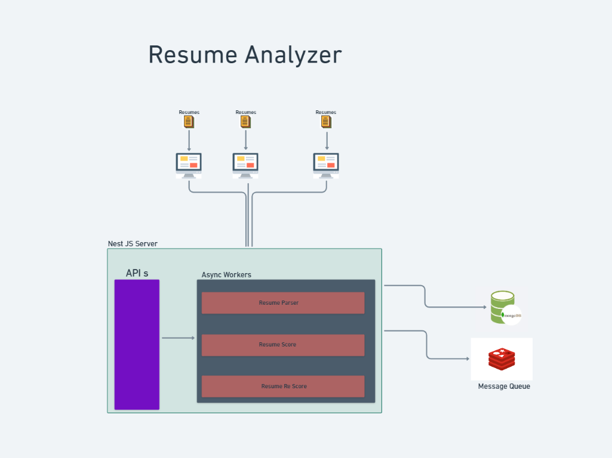

# 

# Resume Analyzer 🚀

> **Note:** This application is currently in active development. Features and functionality may change.

Resume Analyzer is an AI-powered SaaS tool designed to Rank applicants resume along with a feedback. It leverages advanced language models to provide accurate insights, helping recruiters efficiently evaluate candidates.

## 🛠 Tech Stack

- **Frontend:** Next.js (TurboRepo)
- **Backend:** NestJS
- **Database:** MongoDB
- **Storage:** AWS S3 for resume file storage
- **Message Queue:** BullMq with Redis for Managing Workers.

## ✨ Features

- 🔍 **AI-Powered Resume Analysis** – Uses LLMs for accurate resume-job scoring.
- 📂 **Bulk Resume Processing** – Supports analyzing thousands of resumes efficiently.
- ☁️ **Applicants Management ** – Manage Candidates search, filter, sort.


## 🏗 Getting Started

1. Clone the repository:
   ```bash
   git clone https://github.com/dileepbc01/resume-analyser.git
   ```
2. Install dependencies:
   ```bash
   cd resume-analyzer
   pnpm install
   ```
3. Start development:
   ```bash
   pnpm dev
   ```

## ☁️ Deployment

- **Backend:** Deployed on AWS using Docker Image on App Runner.
- **Frontend:** Hosted on Vercel.
- **Database:** MongoDB Atlas.
- **Storage:** AWS S3.

## 📜 License

MIT License

---

🚀 Start analyzing resumes today with [Resume Analyzer](https://resume-analyzer.dileeptechlab.com/)!

## Architecture



## How Resume Scoring Algorithm Works

- In a job, we define a number of criteria to score resumes. Each criterion has a set of parameters, and each criterion is assigned a respective weight.
- For example:
  - For the job "Full Stack Engineer," we define criteria as:
    - **Technical Competence** (Weight: 35%)
      - Parameters: Technical Skills, Domain Knowledge, Programming Languages, Project Complexity, Problem Solving
    - **Professional Experience** (Weight: 25%)
      - Parameters: Years Experience, Relevant Experience, Project Impact, Project Scope, Career Progression
    - **Education** (Weight: 15%)
      - Parameters: Degree, Relevant Coursework, Certifications, Conference Presentations, Self Learning, Research
    - **Leadership** (Weight: 10%)
      - Parameters: Leadership Roles, Team Collaboration, Conflict Resolution, Mentorship, Interpersonal Skills
    - **Role Alignment** (Weight: 15%)
      - Parameters: Job Requirements, Company Values, Team Dynamics, Work Life Balance, Personal Interests

- The algorithm evaluates resumes against the job description using these criteria and parameters.
- Each parameter is scored from 0 to 1 (0 = no match, 1 = perfect match).
- The final score is calculated by combining the parameter scores, weighted by the importance of each criterion.